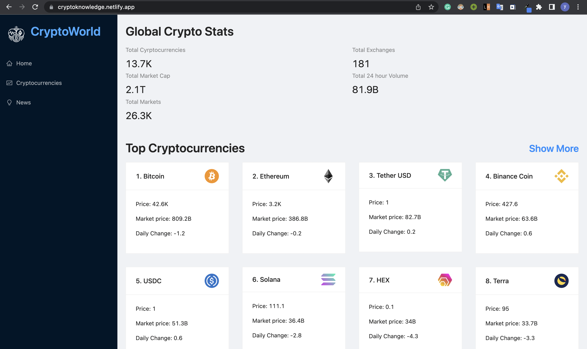
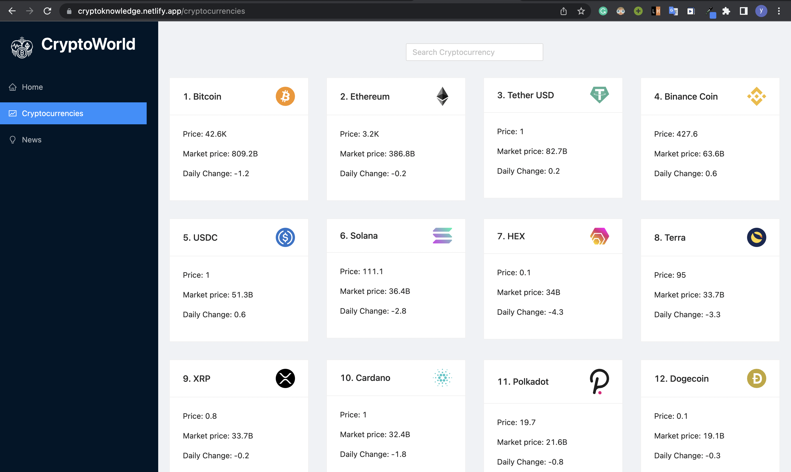
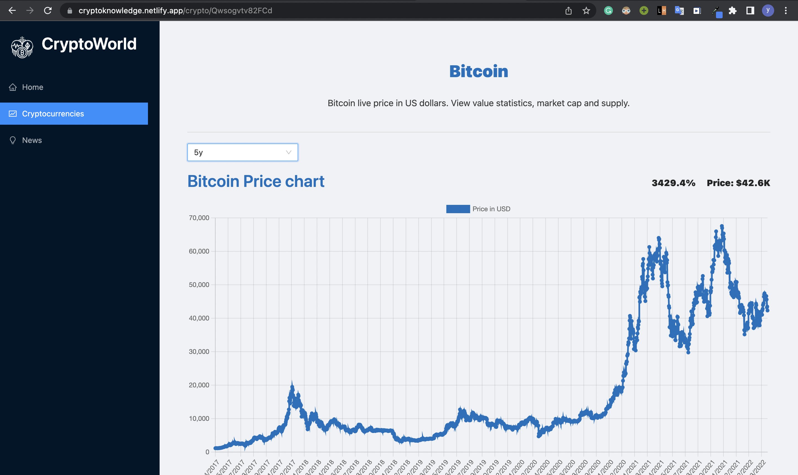
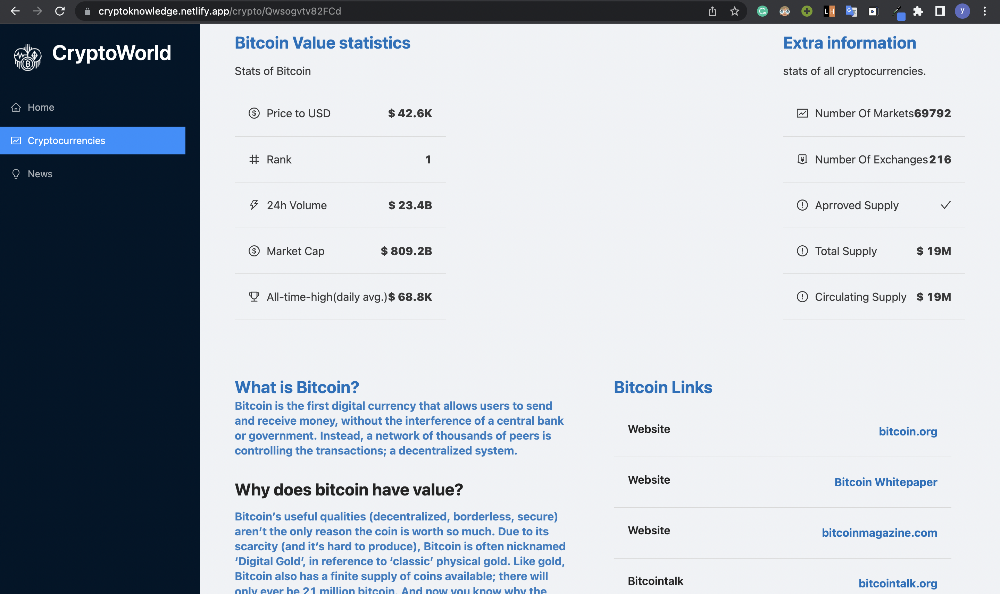

# Crypto World
Crypto World is a responsive website that provides a lot of information about various cryptocurrencies. It also provides the trending news about cryptocurrencies. We can filter the news based on cryptocurrency. For a cryptocurrency, we can know the current price, 24-hour volume, rank, market cap, various links related to it, price change over time visually with the help of charts, etc.  

## Deployed web app link

#### Click to open web app : [Crypto World](https://cryptoknowledge.netlify.app/)

## Screenshots

## Features

- Filtering news based on cryptocurrency
- Searching a cryptocurrency
- Graph of price change of every cryptocurrency
- Statistics of every cryptocurrency
- Responsive

## Frontend

- #### Frontend Library : [React JS](https://reactjs.org/)
- #### State management : [Redux](https://redux.js.org/)
